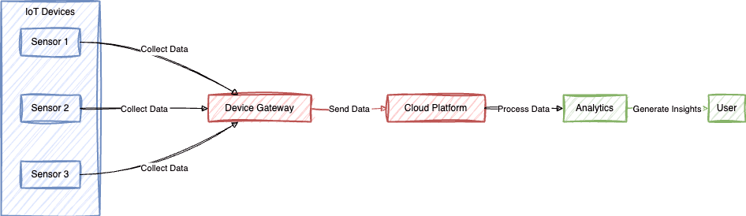
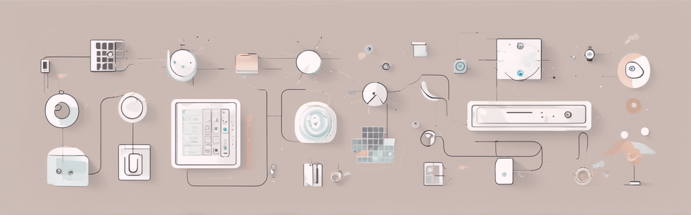

# Can IoT Work Without the Internet? Exploring the Possibilities  🤔

Have you ever wondered how the "Internet" in IoT (Internet of Things) can sometimes seem optional? If the "I" in IoT stands for Internet, you might be asking yourself, "How could IoT work without the Internet?" This blog post aims to delve into this intriguing question and shed light on the fascinating world of IoT, exploring its possibilities beyond the confines of the internet.

In this exploration, we will uncover scenarios where IoT devices can operate independently, making use of alternative communication technologies and local networks. But to truly appreciate the scope and limitations of IoT without the internet, we'll need to first understand what IoT is, why it's important, and how it functions at its core. So, let's embark on this journey together and discover the exciting realm of IoT possibilities, both within and beyond the vast world of the internet.

## Understanding IoT: Its Significance 🌍🔌

Before we dive deeper into the topic, let's first understand what IoT is and why it holds such significance in today's world. IoT, short for the Internet of Things, refers to a network of interconnected devices that can communicate and share data with each other. These devices can range from everyday objects like smart thermostats and fitness trackers to industrial machinery and vehicles.

The importance of IoT lies in its ability to enhance efficiency, convenience, and automation in various aspects of our lives. By connecting devices and enabling them to collect and exchange data, IoT technology enables us to make informed decisions, optimize processes, and create smarter, more sustainable environments.

## The Mechanics of IoT: A Closer Look 📶💡

To understand whether IoT can function without the internet, it's essential to grasp how an IoT system operates. At its core, an IoT system consists of three main components: the devices, the network, and the cloud.

The devices, often equipped with sensors and actuators, collect data from the environment or perform specific actions. These devices can include anything from temperature sensors in a smart home to GPS trackers in a fleet of vehicles.

The network connects these devices, allowing them to communicate and share data. This network can be wired or wireless, depending on the specific use case. Wireless technologies like Wi-Fi, Bluetooth, and Zigbee are commonly used for IoT applications due to their flexibility and ease of deployment.

The cloud serves as the central hub where the collected data is stored, processed, and analyzed. Cloud services provide scalability, real-time insights, and the ability to remotely control and manage IoT devices.

## IoT Beyond the Internet: Possibilities Unveiled 🌐🔌

Despite its name, IoT does not necessarily need the internet to work. There are scenarios where IoT devices can function independently, leveraging other communication technologies. Let's explore some of these possibilities:

### Intranet Communication: IoT Within Local Networks 📡🔒

IoT devices can communicate with each other within a local network without the need for an internet connection. This means that they can exchange data and perform actions within a confined environment, facilitated by self-hosted MQTT brokers like Mosquitto, HiveMQ, and EMQX. To enhance this local setup further, you can also use cross-platform MQTT clients like Mqtizer. For example, a smart home equipped with IoT devices can automate tasks like turning on lights, adjusting the thermostat, or even brewing a fresh cup of coffee, all without relying on the internet. Mqtizer can be utilized to simulate sensors and monitor MQTT traffic within this environment, adding a layer of control and monitoring to your local IoT ecosystem.

### Wireless Communication: The Role of Bluetooth 📶🔗

Certain IoT devices utilize Bluetooth or other short-range wireless technologies to establish connections. These technologies enable devices to communicate with each other over short distances, typically within a few meters. This makes them suitable for applications like home automation, healthcare monitoring, and asset tracking, where internet connectivity may not be necessary.

For instance, a Bluetooth-enabled fitness tracker can collect data about your heart rate, steps taken, and sleep patterns. This data can then be synced with your smartphone or computer when they come into close proximity, allowing you to monitor your health and fitness progress without the need for an internet connection.

### Edge Computing: Data Processing at the Source 💻🔄

Edge computing is a paradigm that brings data processing and analysis closer to the source, reducing the reliance on cloud services. By processing data locally on the IoT devices themselves or on nearby edge servers, the need for constant internet connectivity can be minimized.

This approach is particularly useful in scenarios where real-time decision-making is critical or where internet connectivity may be unreliable or expensive. For example, in industrial settings, edge computing can enable predictive maintenance by analyzing sensor data in real-time and triggering maintenance actions locally, without the need to send data to the cloud.

### LPWAN: Enabling IoT Across Vast Distances 📡🌍

Low Power Wide Area Networks (LPWAN) are wireless communication technologies designed specifically for IoT devices. LPWAN technologies, such as LoRaWAN and Sigfox, provide long-range connectivity with low power consumption, making them suitable for applications that require wide coverage and extended battery life.

LPWAN enables IoT devices to communicate over large distances, even in remote areas where internet connectivity may be limited or unavailable. This makes LPWAN an ideal choice for applications like smart agriculture, asset tracking, and environmental monitoring.

## Challenges Faced by IoT in Offline Mode 🚫🌐

While IoT can work without the internet, it is important to acknowledge the limitations that come with this approach. Here are some of the key limitations:

### Limited Data Accessibility 📊🔒

Without internet connectivity, IoT devices are confined to their local network, limiting their ability to access external data sources. They cannot retrieve real-time information from the internet or tap into cloud services, which are essential for many IoT applications. This means that the data collected and actions performed by these devices may be restricted to the local environment.

### Lack of Remote Control and Monitoring 📱🔍

One of the significant advantages of IoT is the ability to remotely control and monitor devices from anywhere in the world. However, without an internet connection, this capability is lost. IoT devices operating in an offline mode cannot be controlled or monitored remotely, which may limit their usefulness in certain scenarios.

### Reduced Scalability and Flexibility 📉🔗

Internet connectivity allows IoT systems to scale and adapt to changing requirements seamlessly. Cloud services provide the infrastructure and resources needed to handle large amounts of data and support a growing number of devices. Without the internet, the scalability and flexibility of an IoT system may be compromised, making it challenging to expand or modify the network as needed.

## Conclusion: Embracing the Possibilities of IoT 🌐💡

In conclusion, IoT can indeed work without the internet, but it is important to understand the limitations and possibilities associated with this approach. While some IoT devices can function independently within a local network or leverage alternative communication technologies like Bluetooth and LPWAN, they may face constraints in terms of data accessibility, remote control, and scalability.

However, it is worth noting that IoT's true potential is realized when it is connected to the internet. Internet connectivity opens up a world of possibilities, enabling real-time data analysis, remote management, and seamless integration with cloud services. By harnessing the power of the internet, IoT can transform industries, improve efficiency, and enhance our daily lives.

So, whether you're exploring the possibilities of IoT without the internet or embracing the full potential of connected devices, the world of IoT is undoubtedly an exciting and transformative one.

---

### References
- <a href="https://www.quora.com/How-does-an-IoT-device-work-without-a-constant-or-reliable-internet-connection" target="_blank">How does an IoT device work without a constant or reliable internet connection? - Quora</a>
- <a href="https://www.youtube.com/watch?v=fHhaoyPaTWw" target="_blank">Offline IoT - Building Resilient Connected Devices without the Internet by Nick Hehr</a>
- <a href="https://www.intuz.com/blog/iot-work-without-internet" target="_blank">Does IoT Work Without The Internet? - Intuz</a>
