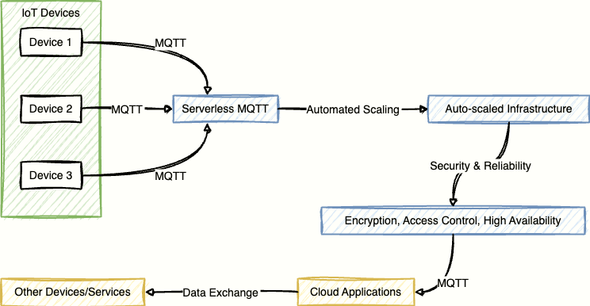

# Serverless MQTT: The Future of IoT Messaging 🚀

MQTT is a lightweight and efficient protocol for IoT messaging. It enables devices to communicate with each other and with cloud services using a publish/subscribe model. MQTT is widely used in various IoT scenarios, such as smart home, industrial automation, connected cars, and more.

However, managing and scaling an MQTT broker can be challenging and costly. You need to provision servers, configure network settings, monitor performance, handle security issues, and deal with unexpected failures. Moreover, you need to anticipate the demand and scale your infrastructure accordingly, which can be tricky and wasteful.

That's where serverless MQTT comes in. Serverless MQTT is a cloud-based MQTT service that automatically scales based on the number of connected devices and the amount of traffic. You don't need to worry about server management or capacity planning. You only pay for what you use, and you can enjoy the benefits of a reliable, secure, and scalable MQTT service.

In this blog post, we will compare some of the popular serverless MQTT cloud providers and see how they can help you build your IoT applications faster and easier.

## What is Serverless MQTT? 🤔

Serverless MQTT is a type of cloud service that provides MQTT messaging without requiring you to manage any servers or infrastructure. It is based on the concept of serverless computing, which allows you to run code or applications without provisioning or managing servers.

Serverless MQTT service is designed to scale automatically based on demand. It can automatically allocate infrastructure resources based on usage, and releases them when they are no longer required. This way, you can avoid overprovisioning or underprovisioning your MQTT broker, and optimize your costs and performance.

Serverless MQTT service also takes care of the security and reliability aspects of your MQTT messaging. It encrypts your data in transit and at rest, protects your devices from unauthorized access, and ensures high availability and fault tolerance.

With serverless MQTT service, you can focus on developing your IoT applications without worrying about the underlying infrastructure. You can easily connect your devices to the cloud and exchange data with other devices or services using the MQTT protocol.

Certainly! Here's a section highlighting the benefits of Serverless MQTT:

## Benefits of Serverless MQTT 🌐

Serverless MQTT offers a range of advantages that make it a compelling choice for IoT developers and businesses. By embracing the serverless paradigm, you unlock the following benefits:

1. **Automatic Scaling:** Serverless MQTT services automatically scale based on the number of connected devices and data traffic. This ensures optimal performance without the need for manual intervention, allowing your IoT infrastructure to seamlessly adapt to changing workloads.

2. **Cost Optimization:** With serverless MQTT, you pay only for the resources you consume. There's no need to provision and maintain servers, reducing operational costs. This cost-efficient model is particularly advantageous for projects with variable workloads or those in the prototyping phase.

3. **Simplified Management:** Serverless MQTT eliminates the burden of server management tasks, such as provisioning, configuration, and monitoring. This simplicity allows developers to focus more on application development and less on infrastructure maintenance, leading to faster time-to-market for IoT solutions.

4. **Enhanced Security:** Serverless MQTT services often come with built-in security features. They encrypt data in transit and at rest, implement authentication and authorization mechanisms, and provide secure communication channels. This ensures the integrity and confidentiality of your IoT data.

5. **Reliability and High Availability:** Serverless MQTT providers typically ensure high availability and fault tolerance. By distributing infrastructure across multiple locations, these services mitigate the risk of outages, providing a reliable messaging backbone for your IoT applications.

6. **Optimized Resource Utilization:** Serverless MQTT efficiently allocates resources based on usage and releases them when not needed. This prevents overprovisioning and underprovisioning, optimizing resource utilization and, consequently, reducing operational inefficiencies.

7. **Faster Development Cycles:** By abstracting away the complexities of server management, serverless MQTT accelerates development cycles. Developers can quickly prototype, test, and iterate on IoT applications without being encumbered by infrastructure-related challenges.

8. **Global Reach:** Many serverless MQTT providers offer multi-region support, allowing you to deploy your IoT infrastructure in geographic locations that best suit your needs. This enables you to enhance the responsiveness and performance of your applications for users around the world.

## Serverless MQTT Cloud Providers 🌐

There are several cloud providers that offer serverless MQTT service for IoT applications. Here are some of the most popular ones:

### EMQX Cloud Serverless

<a href="https://www.emqx.com/en/cloud/serverless-mqtt" target="_blank">EMQX Cloud Serverless</a>
is a new edition of EMQX Cloud, which is a fully managed MQTT service powered by EMQX Broker. EMQX Broker is an open-source and enterprise-grade MQTT broker that supports millions of concurrent connections and massive data processing.

EMQX Cloud Serverless allows you to create a fully functional MQTT deployment in 5 seconds with a few clicks. You can enjoy 1 million free session minutes each month, which is enough to keep 23 devices online 24x7 for 30 days. You can also pay as you go for additional usage based on the number of connected devices and online time.

EMQX Cloud Serverless supports multiple regions across the world, such as AWS US East (N. Virginia), AWS EU (Frankfurt), AWS Asia Pacific (Singapore), etc. You can choose the region that suits your needs best.

EMQX Cloud Serverless also provides various features to enhance your IoT messaging experience, such as:

- Web console for managing your deployments, devices, rules, plugins, etc.
- REST API for integrating with other services or applications
- Webhook for triggering actions based on events
- Rule engine for processing data streams in real time
- Dashboard for monitoring your deployments' status and metrics
- TLS/SSL encryption for securing your data
- Authentication and authorization for controlling access to your devices
- Bridge for connecting multiple MQTT brokers or clusters
- Plugin system for extending functionality

EMQX Cloud Serverless is ideal for rapid prototyping, small and medium-sized businesses, and time-sensitive projects that require a fast and easy way to deploy an MQTT service.

### HiveMQ Cloud

<a href="https://www.hivemq.com/cloud/" target="_blank">HiveMQ Cloud</a>
is another fully managed MQTT service that is based on HiveMQ Broker. HiveMQ Broker is an enterprise-ready MQTT broker that supports high scalability and reliability.

HiveMQ Cloud offers a free plan that allows you to connect up to 100 devices with 10 GB of data transfer per month. You can also upgrade to a paid plan that starts from $49 per month and supports up to 10,000 devices with 100 GB of data transfer.

HiveMQ Cloud supports multiple regions across the world, such as AWS US East (Ohio), AWS EU (Ireland), AWS Asia Pacific (Tokyo), etc. You can choose the region that is closest to your devices or customers.

HiveMQ Cloud also provides various features to enhance your IoT messaging experience, such as:

- Web console for managing your deployments, devices, users, etc.
- REST API for integrating with other services or applications
- Webhook for triggering actions based on events
- MQTT client library for connecting your devices using different languages
- TLS/SSL encryption for securing your data
- Authentication and authorization for controlling access to your devices
- MQTT 5 support for using the latest features of the MQTT protocol

HiveMQ Cloud is ideal for small and medium-sized businesses and projects that require a reliable and scalable MQTT service.

### AWS IoT Core

<a href="https://aws.amazon.com/iot-core/" target="_blank">AWS IoT Core</a> is a managed cloud service that lets you connect and manage your IoT devices using MQTT or HTTP protocols. It supports up to 500,000 devices per account and charges based on the number of messages and data transfer.

AWS IoT Core provides various features to enhance your IoT messaging experience, such as:

- Device shadow for storing and syncing device state information
- Device registry for organizing and tracking your devices
- Device defender for detecting and mitigating security threats
- Device management for remotely managing your devices
- Rules engine for processing data streams in real time
- Greengrass for running local compute, messaging, and sync on edge devices
- FreeRTOS for running embedded software on microcontrollers

AWS IoT Core is ideal for projects that require a robust and flexible MQTT service that integrates well with other AWS services.

### Azure IoT Hub
<a href="https://azure.microsoft.com/en-us/services/iot-hub/" target="_blank">Azure IoT Hub</a>
is a managed cloud service that enables you to connect and manage your IoT devices using MQTT, AMQP, or HTTP protocols. It supports up to 1 million devices per account and charges based on the number of messages and data transfer.

Azure IoT Hub provides various features to enhance your IoT messaging experience, such as:

- Device twins for storing and syncing device state information
- Device provisioning service for registering and provisioning your devices
- Device identity registry for organizing and tracking your devices
- Device management for remotely managing your devices
- Message routing for processing data streams in real time
- IoT Edge for running local compute, messaging, and sync on edge devices
- Azure Sphere OS for running embedded software on microcontrollers

Azure IoT Hub is ideal for projects that require a reliable and scalable MQTT service that integrates well with other Azure services.

### Google Cloud IoT Core (has been retired)

<a href="https://cloud.google.com/iot-core" target="_blank">Google Cloud IoT Core</a> is a managed cloud service that allows you to connect and manage your IoT devices using MQTT or HTTP protocols. It supports up to 250,000 devices per account and charges based on the number of messages and data transfer.

Google Cloud IoT Core provides various features to enhance your IoT messaging experience, such as:

- Device manager for storing and syncing device state information
- Device registry for organizing and tracking your devices
- Cloud Pub/Sub for processing data streams in real time
- Cloud Functions for running serverless code in response to events
- Cloud ML Engine for applying machine learning models to your data
- Cloud IoT Edge for running local compute, messaging, and sync on edge devices

Google Cloud IoT Core is ideal for projects that require a simple and secure MQTT service that integrates well with other Google Cloud services.

## Conclusion 🎉

Serverless MQTT is a great way to simplify and optimize your IoT messaging. It frees you from the hassle of server management and scaling, and lets you focus on developing your IoT applications. It also provides security, reliability, and performance benefits for your IoT messaging.

There are several serverless MQTT cloud providers that you can choose from based on your needs and preferences. Some of the popular ones are EMQX Cloud Serverless, HiveMQ Cloud, AWS IoT Core, Azure IoT Hub, Google Cloud IoT Core, etc.

We hope this blog post has helped you understand what serverless MQTT is and how it can help you build your IoT applications faster and easier. If you have any questions or feedback, please feel free to leave a comment below.

### References

- <a href="https://www.emqx.com/en/cloud/serverless-mqtt" target="_blank">Secure, Scalable, and Serverless MQTT Messaging | EMQ</a>
- <a href="https://www.emqx.com/en/blog/how-to-use-mqttx-for-serverless-mqtt-broker-test" target="_blank">Connecting to Serverless MQTT Broker using MQTTX: A Quick Guide</a>
- <a href="https://dev.to/emqx/serverless-mqtt-your-key-to-efficient-iot-prototyping-460b" target="_blank">Serverless MQTT: Your Key to Efficient IoT Prototyping - DEV Community</a>
