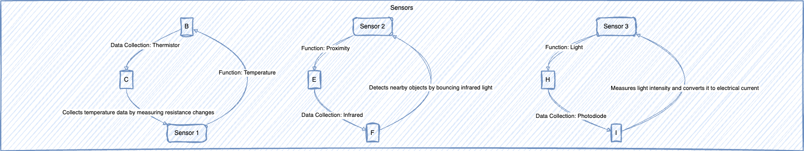
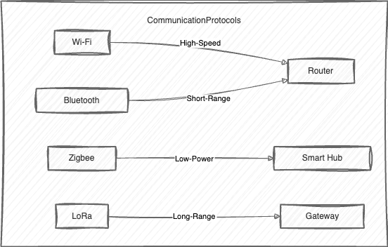
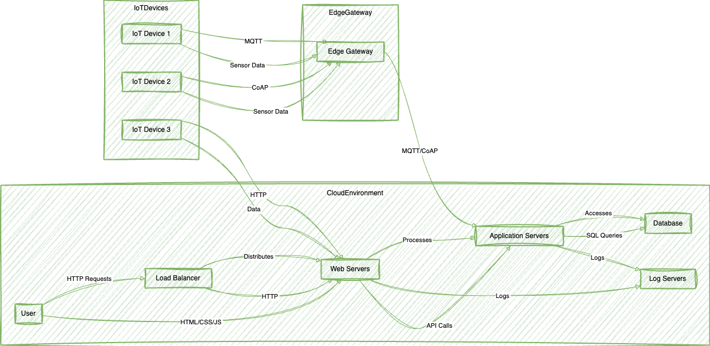
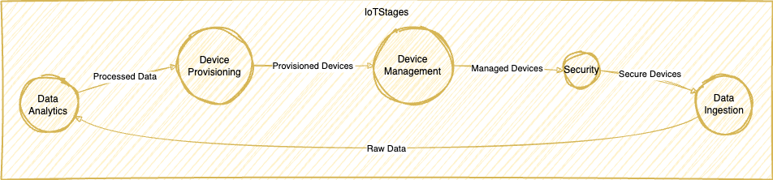

# 5 Skills You Need to Start a Career in IoT

Are you fascinated by the world of interconnected devices and the endless possibilities they bring? If you're considering a career in the Internet of Things (IoT), you're in the right place! In this blog post, we will explore the essential skills you need to kickstart your journey in the exciting field of IoT. Whether you're a recent graduate or a seasoned professional looking to switch careers, these skills will equip you with the knowledge and expertise to thrive in the IoT industry. So, let's dive in and discover the five skills that will set you on the path to a successful IoT career!

## Understanding the Nitty-Gritty of Sensors 🎛️

To excel in the IoT field, it's crucial to have a deep understanding of sensors and their functionalities. Sensors are the backbone of IoT systems, as they collect data from the physical world and enable devices to interact with their environment. As an IoT engineer, you'll be responsible for selecting and integrating sensors into your projects. Familiarizing yourself with various sensor types, such as temperature sensors, motion sensors, and moisture sensors, will give you a solid foundation to build upon. Additionally, gaining knowledge about sensor calibration, data accuracy, and power management will help you optimize the performance of your IoT solutions.

## Paying Close Attention to UI 👀

User Interface (UI) design plays a vital role in creating intuitive and user-friendly IoT applications. When developing IoT solutions, you'll need to ensure that the user interface is visually appealing, easy to navigate, and provides a seamless user experience. Understanding the principles of UI design, such as color theory, typography, and layout, will enable you to create interfaces that are both aesthetically pleasing and functional. Moreover, acquiring skills in prototyping tools like Sketch or Adobe XD will allow you to bring your design concepts to life and gather valuable feedback from stakeholders.

## Gaining Experience in Programming Languages 🖥️

Proficiency in programming languages is a must-have skill for any aspiring IoT engineer. While there are several programming languages used in the IoT ecosystem, two languages stand out as essential: Python and C/C++. Python is known for its simplicity and versatility, making it a popular choice for IoT development. It offers a wide range of libraries and frameworks that simplify tasks like data processing, machine learning, and web development. On the other hand, C/C++ is widely used for low-level programming and is particularly suitable for resource-constrained IoT devices. Familiarizing yourself with these languages will empower you to develop robust and efficient IoT applications.

## Understanding Wireless Stacks and Communication Protocols

In the world of IoT, wireless communication is the key to connecting devices and enabling seamless data exchange. Therefore, it's crucial to have a solid understanding of wireless stacks like Zigbee, Thread, or BLE-Mesh. These protocols define how devices communicate with each other and form a network. Additionally, being proficient in communication protocols such as I2C, SPI, 1-wire, UART, MODBUS, and DALI will allow you to interface with various sensors and actuators. By mastering these wireless stacks and protocols, you'll be able to design and implement reliable and secure IoT systems.

## Proficiency in Cloud Programming and Architecture ☁️

Cloud computing is an integral part of the IoT ecosystem, as it provides a scalable and secure platform for storing and processing IoT data. To start a successful career in IoT, it's essential to have a solid understanding of not only cloud programming but also cloud architecture. In this section, we'll explore why both of these aspects are crucial for IoT professionals.

### Cloud Programming

Familiarize yourself with cloud platforms like Amazon Web Services (AWS), Microsoft Azure, or Google Cloud Platform (GCP). These platforms offer a wealth of services and tools specifically designed for IoT applications. Learning how to leverage cloud services such as data storage, data analytics, and machine learning will be invaluable for building powerful IoT applications. With cloud programming skills, you'll be able to harness the full potential of the cloud and unlock new possibilities for your IoT projects.

### Cloud Architecture

In addition to programming, understanding cloud architecture is essential for designing robust and scalable IoT solutions. Cloud architecture involves structuring your IoT applications to make the most of cloud resources efficiently. It includes considerations such as data flow, scalability, redundancy, and security. By mastering cloud architecture, you can ensure that your IoT projects are not only functional but also cost-effective and capable of handling increased workloads as your IoT ecosystem grows.

## The Five Stages of IoT 🔄

Now that we've explored the essential skills needed to start a career in IoT, let's take a closer look at the five stages of IoT. These stages represent the lifecycle of an IoT solution, from data ingestion to security:

1. Data Ingestion: In this stage, data is collected from various sensors and devices and sent to a central repository for further processing.

2. Data Analytics: Once the data is ingested, it's analyzed to extract meaningful insights and patterns. Data analytics techniques like machine learning and statistical analysis are applied to uncover hidden trends and make data-driven decisions.

3. Device Provisioning: In this stage, devices are provisioned and configured to connect to the IoT network. This involves setting up network parameters, security credentials, and device-specific configurations.

4. Device Management: After the devices are provisioned, they need to be monitored and managed throughout their lifecycle. Device management includes tasks like firmware updates, remote diagnostics, and performance optimization.

5. Security: Security is a critical aspect of IoT, as interconnected devices are vulnerable to cyber threats. This stage focuses on implementing robust security measures to protect IoT systems from unauthorized access, data breaches, and other security risks.

By understanding these five stages, you'll gain a holistic view of the IoT lifecycle and be better equipped to design and implement end-to-end IoT solutions.

## The Four Important Components of IoT 🧩

In addition to the five stages, it's essential to familiarize yourself with the four important components of IoT:

1. Devices: IoT devices are the physical objects that collect and transmit data. These can range from simple sensors to complex industrial machinery. Understanding the capabilities and limitations of different IoT devices will help you choose the right hardware for your projects.

2. Gateways: Gateways act as intermediaries between IoT devices and the cloud. They enable data aggregation, protocol translation, and local processing. Familiarizing yourself with gateway technologies will allow you to design scalable and efficient IoT architectures.

3. Cloud Programming: As mentioned earlier, cloud computing is a fundamental component of IoT. Cloud platforms provide the infrastructure and services required to store, process, and analyze IoT data. Learning how to leverage cloud programming will enable you to build scalable and cost-effective IoT solutions.

4. UI/UX Design: User Interface (UI) and User Experience (UX) design are crucial for creating intuitive and engaging IoT applications. By focusing on UI/UX design, you'll be able to deliver seamless and delightful user experiences, increasing the adoption and success of your IoT solutions.

## Conclusion 🎉

Congratulations! You've now discovered the five essential skills you need to start a successful career in IoT. From understanding sensors to mastering cloud programming, these skills will equip you with the knowledge and expertise to thrive in the IoT industry. Remember, starting a career in IoT requires continuous learning and staying up-to-date with the latest advancements in the field. So, keep exploring, experimenting, and honing your skills to unlock the endless possibilities of the Internet of Things. Are you ready to embark on your IoT journey? The future awaits!

### References

- <a href="https://www.techtarget.com/whatis/feature/Top-7-must-have-IoT-skills-to-boost-your-career" target="_blank">Top 7 Must-Have IoT Skills to Boost Your Career</a>
- <a href="https://101blockchains.com/top-iot-engineer-skills/" target="_blank">Skills You Need to Become an IoT Engineer</a>
