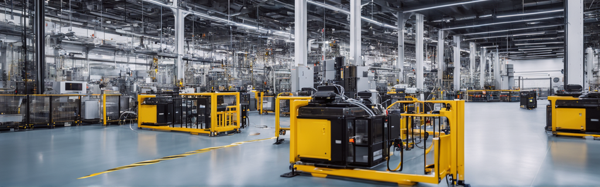
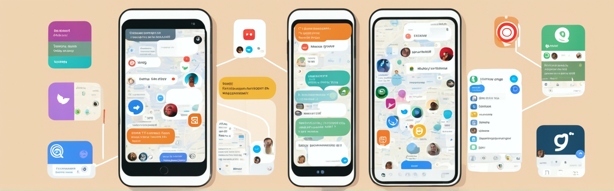

# Where is MQTT Used? 🚀 Real-World Applications

MQTT, short for Message Queuing Telemetry Transport, is the unsung hero of modern communication protocols. 🦸‍♂️ Its lightweight and efficient design have sparked a revolution in various industries and applications. Imagine a world where devices talk to each other seamlessly; that's MQTT at work! 📡 In this blog post, we'll explore MQTT's thrilling real-world adventures and showcase its primary applications across different sectors. From industrial IoT and connected cars 🚗 to home automation 🏡 and mobile apps 📱, MQTT is the ultimate connector of the digital era. Let's dive into the action! 💥

## Introduction 🌐

In today's interconnected world, where billions of devices are constantly generating and exchanging data, a reliable and efficient messaging protocol is essential. MQTT swoops in as the superhero 🦸‍♀️ providing a lightweight, reliable solution for connecting devices and enabling seamless communication. With its publish-subscribe architecture, MQTT allows devices to publish messages to a central broker, which then delivers those messages to all subscribed devices or applications. This decoupled communication model offers flexibility, scalability, and real-time data exchange capabilities, making MQTT the go-to protocol for many industries. 🚀

## ⚙️ Industrial IoT: Real-Time Monitoring and Control

One of MQTT's star-studded performances is in Industrial IoT (IIoT). In factories, MQTT steps in as the vigilant guardian 🦸‍♂️, facilitating real-time monitoring and control of various processes. Picture this: temperature sensors in furnaces send urgent messages 🚨 to an MQTT broker on a server. The server, acting as a wise overseer, analyzes the data and takes swift action if the temperature crosses the danger zone. Potential damage or downtime is thwarted, thanks to MQTT's lightweight nature and its knack for handling low-bandwidth connections. 🌡️

## 🚗 Connected Cars: Enabling Communication and Data Exchange

In the thrilling world of connected vehicles, MQTT takes the driver's seat 🚗. Telematics systems rely on MQTT to collect data such as location, speed, and fuel levels from cars and beam it to an MQTT broker. This data fuels epic adventures in fleet management, vehicle maintenance, and driver safety. MQTT's unwavering reliability and ability to handle even the bumpiest network roads make it the go-to choice for transmitting real-time data from zooming vehicles. 🗺️

## 🏡 Home Automation Systems: Seamless Device Integration

Imagine your home as a smart fortress 🏰 where lights, thermostats, security cameras, and appliances are your loyal knights. MQTT is the wizard 🧙‍♂️ behind the curtain, enabling these devices to communicate with a central hub, fostering a harmonious kingdom of automation. For instance, your trusty smart thermostat sends out temperature updates 🌡️ to an MQTT broker, allowing other devices to join the royal council and adjust settings accordingly. MQTT's lightweight powers and low network demands make it a perfect ally for home automation quests. 🏰

## 🛢️ Oil and Gas Industry: Data Exchange in Challenging Environments

MQTT's adventures take it to the remote and hazardous terrains of the oil and gas industry. Here, MQTT's publish-subscribe mechanism proves invaluable, efficiently retrieving data from distant pipelines and delivering it to SCADA systems. In these challenging conditions, where traditional communication methods falter, MQTT rushes in like a fearless explorer 🏞️. Quick and efficient data exchange becomes the norm, enabling real-time monitoring of pipeline conditions and data gathering from the wild. 🚁

## 📱 Mobile Applications: Real-Time Communication and Data Synchronization

In the bustling world of mobile apps, MQTT wears the crown 👑. Its support for unreliable networks and low bandwidth makes it the champion of messaging apps, social media platforms, and real-time data streaming applications. Imagine your mobile device as a superhero headquarters 🦸‍♂️. MQTT ensures that messages and updates are delivered in the nick of time, whether it's mobile messaging, location tracking, or collecting sensor data. It's the trusty sidekick you need for your mobile adventures. 📲

## Conclusion 🚀

MQTT is the unsung hero of messaging protocols, making waves in various industries and domains. From Industrial IoT to smart homes, MQTT enables efficient and reliable communication between devices. Its lightweight nature, support for unreliable networks, and low bandwidth requirements make it a universal superhero. As IoT continues to evolve, MQTT will be there, bridging the gaps and enabling communication in the ever-expanding digital world. 🌍🌟

---

### References:

- <a href="https://www.emqx.com/en/blog/iiot-explained-examples-technologies-benefits-and-challenges" target="_blank">Industrial IoT: Explained with Examples, Technologies, Benefits, and Challenges</a>
- <a href="https://www.emqx.com/en/blog/mqtt-uses-in-connected-cars" target="_blank">MQTT Uses in Connected Cars: How MQTT Works in Telematics Systems</a>
- <a href="https://www.influxdata.com/solutions/consumer-iot/" target="_blank">Consumer IoT: MQTT for Smart Homes and Wearable Devices</a>
- <a href="https://www.influxdata.com/blog/mqtt-use-cases/" target="_blank">MQTT Use Cases: Where and How MQTT is Used</a>

