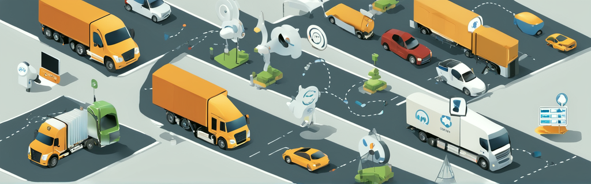

# Where is MQTT Used? Exploring Real-World Applications

MQTT, which stands for Message Queuing Telemetry Transport, is a lightweight publish-subscribe messaging protocol designed for machine-to-machine communication in low bandwidth environments. It was developed in 1999 and has since become the de facto standard for connecting devices and enabling efficient communication in the Internet of Things (IoT) ecosystem. In this blog post, we will explore the real-world applications of MQTT, its usage in different industries, and the products that leverage MQTT for seamless data exchange.

## MQTT in the Real World

### Smart Homes and Home Automation 🏠

One of the most common applications of MQTT is in the realm of smart homes and home automation. MQTT's lightweight nature and efficient publish-subscribe model make it an ideal choice for connecting various smart devices within a home network. For example, a smart thermostat can publish temperature and humidity data to an MQTT broker, while a smart lighting system can subscribe to these messages and adjust the lighting accordingly. MQTT enables seamless communication between different devices, allowing homeowners to control and monitor their smart home systems from a centralized interface.

### Industrial IoT and Manufacturing 🏭

MQTT plays a crucial role in the Industrial Internet of Things (IIoT) and modernizing the manufacturing industry. With the advent of Industry 4.0, factories and industrial facilities are increasingly adopting IoT technologies to improve operational efficiency and enable real-time monitoring. MQTT's low bandwidth requirements and support for reliable message delivery make it an excellent choice for connecting sensors, machines, and control systems in industrial environments. By leveraging MQTT, manufacturers can collect and analyze data from various sources, optimize production processes, and detect anomalies or faults in real-time.

### Transportation and Fleet Management 🚚

The transportation industry also benefits from MQTT's capabilities. Fleet management systems rely on MQTT to gather data from vehicles, such as GPS coordinates, fuel levels, and engine diagnostics. This data is then transmitted to a central server via MQTT, where it can be analyzed to optimize routes, monitor driver behavior, and ensure timely maintenance. MQTT's lightweight nature is particularly advantageous in this context, as it allows for efficient communication even in bandwidth-constrained environments, such as remote areas with limited network coverage.

### Energy Monitoring and Smart Grids ⚡️

In the field of energy monitoring and management, MQTT is widely used to enable real-time data exchange between smart meters, energy management systems, and utility providers. By leveraging MQTT, utility companies can collect energy consumption data from individual households or commercial buildings, monitor power quality, and optimize energy distribution. MQTT's publish-subscribe model ensures that relevant stakeholders receive timely updates and alerts, enabling efficient energy management and demand response.

### Healthcare and Remote Patient Monitoring 🏥

MQTT finds applications in the healthcare industry, particularly in the context of remote patient monitoring and telemedicine. With MQTT, medical devices, such as wearable sensors or home monitoring systems, can transmit vital signs, medication adherence data, or other health-related information to healthcare providers in real-time. This enables healthcare professionals to remotely monitor patients, detect early warning signs, and provide timely interventions. MQTT's reliability and support for quality of service levels ensure that critical health data is delivered securely and efficiently.

## MQTT in Various Industries

Apart from the specific use cases mentioned above, MQTT is widely used in various industries for efficient and reliable communication. Some notable industries where MQTT finds applications include:

- Agriculture: MQTT enables smart farming systems by connecting sensors, irrigation systems, and weather stations to optimize crop yield and resource utilization.
- Retail: MQTT facilitates real-time inventory management, price updates, and customer analytics in retail environments, enhancing operational efficiency and customer experience.
- Smart Cities: MQTT plays a crucial role in building smart city infrastructure, enabling efficient communication between various components, such as traffic lights, waste management systems, and environmental sensors.
- Oil and Gas: MQTT is utilized in the oil and gas industry for remote monitoring of pipelines, equipment condition monitoring, and predictive maintenance.
- Logistics and Supply Chain: MQTT enables real-time tracking and monitoring of goods, optimizing logistics operations, and ensuring timely delivery.

## Platforms that Provides/Supports MQTT

MQTT is not just a theoretical concept; it is widely implemented in various products and platforms. Some popular products that utilize MQTT for efficient communication include:

- <a href="https://www.home-assistant.io/" target="_blank">Home Assistant</a>: An open-source home automation platform that leverages MQTT for seamless integration of smart devices and systems.
- <a href="https://nodered.org/" target="_blank">Node-RED</a>: A flow-based programming tool that allows users to connect hardware devices, APIs, and online services using MQTT as a messaging protocol.
- <a href="https://www.hivemq.com/" target="_blank">HiveMQ</a>: A scalable MQTT broker that provides enterprise-grade MQTT connectivity for mission-critical IoT applications.
- <a href="https://mosquitto.org/" target="_blank">Eclipse Mosquitto</a>: An open-source MQTT broker that provides a lightweight messaging protocol for IoT applications.
- <a href="https://aws.amazon.com/iot-core/" target="_blank">Amazon IoT Core</a>: A managed cloud service that enables devices to connect securely and interact with AWS services using MQTT as a communication protocol.
- <a href="https://www.influxdata.com/lp/influxdb-database/?utm_term=influxdb" target="_blank">InfluxDB</a>: A time-series database that supports MQTT as a data ingestion protocol, allowing for efficient storage and analysis of IoT sensor data.

These are just a few examples of the wide range of products and platforms that utilize MQTT for seamless and efficient communication in the IoT ecosystem.

## Conclusion

MQTT, as a lightweight publish-subscribe messaging protocol, finds applications in various industries and products. Its efficient and reliable communication capabilities make it an ideal choice for connecting devices, enabling real-time data exchange, and optimizing processes. From smart homes and industrial IoT to transportation and healthcare, MQTT plays a crucial role in modernizing industries and improving operational efficiency. By understanding the real-world applications of MQTT and exploring the products that utilize it, businesses and individuals can harness the power of MQTT to unlock the full potential of the Internet of Things.

---

### References:

- <a href="https://aws.amazon.com/what-is/mqtt/" target="_blank">What is MQTT? - MQTT Protocol Explained - Amazon AWS</a>
- <a href="https://www.techtarget.com/iotagenda/definition/MQTT-MQ-Telemetry-Transport" target="_blank">How is MQTT used in the real world? - TechTarget</a>
- <a href="https://www.hivemq.com/solutions/manufacturing/modernizing-the-manufacturing-industry/" target="_blank">Modernizing the Smart Manufacturing Industry with MQTT - HiveMQ</a>
- <a href="https://iotbyhvm.ooo/mqtt-products/" target="_blank">MQTT Products (that use MQTT) - IoTbyHVM - Bits & Bytes of IoT</a>
- <a href="https://www.influxdata.com/blog/mqtt-use-cases/" target="_blank">8 Real-World MQTT Use Cases - InfluxData</a>
