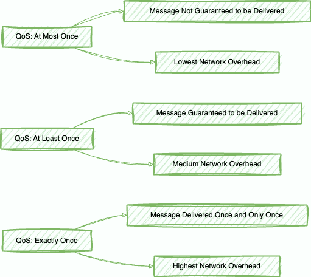
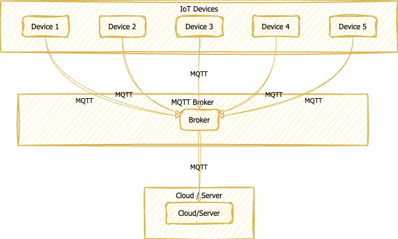
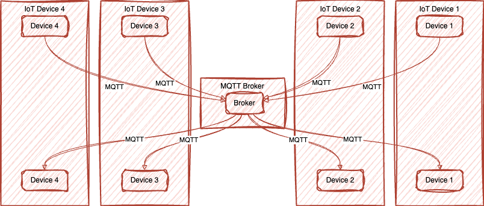

# Why is MQTT So Popular?

The Message Queuing Telemetry Transport (MQTT) protocol has become the preferred messaging standard in the Internet of Things (IoT) industry due to various reasons. 🌟 Its lightweight and efficient design, reliable messaging services, scalability, and secure communication capabilities have contributed to its widespread adoption. 💪 In this blog post, we will explore MQTT's popularity and its critical role in industrial IoT. 🤖

## Introduction

The exponential growth of IoT 📈 has created a demand for dependable and efficient communication protocols capable of managing the vast volume of data transmitted by countless interconnected devices. Among the contenders in this realm, MQTT has emerged as a top contender 💪, offering a slew of advantages that position it as the premier option for IoT applications. Let's explore the main drivers behind MQTT's surging popularity. 🚀

## Lightweight and Efficient

<!--  -->

🚀 One of the main advantages of MQTT is its lightweight and efficient design, which is especially useful for IoT devices that have limited processing power, memory, and battery life. MQTT has a small code footprint and uses low bandwidth, making it an ideal choice for devices with limited resources. By reducing communication overhead, MQTT enables efficient data transfer, which in turn reduces energy consumption, saves costs, and enhances performance, particularly in low-bandwidth networks. 💪

📚 Another reason MQTT is so popular in the IoT world is its ability to run on small micro controllers. This makes it a lightweight and efficient choice for resource-constrained devices. With its low hardware requirements, MQTT can help optimize the performance of IoT devices, while minimizing energy consumption and reducing costs. By enabling efficient data transfer and minimizing communication overhead, MQTT is an excellent option for IoT projects that require reliable and efficient data exchange. 🌟

## Reliable Messaging Services

MQTT stands out as a messaging service renowned for its unwavering reliability, making it the top choice for Internet of Things (IoT) applications. Its exceptional utility becomes apparent in regions with unreliable network connectivity, all thanks to its Quality of Service (QoS) levels. These levels ensure the flawless delivery of messages, free from loss or duplication, and they can be finely tuned to align with the unique demands of each application, guaranteeing peak performance. MQTT offers three distinct QoS levels, each catering to different application requirements.

1. **At Most Once Delivery**: This level is perfectly suited for applications involving sensor data, where occasional message loss is tolerable. It prioritizes minimal network overhead.

2. **At Least Once Delivery**: Here, MQTT ensures message delivery while acknowledging that some duplicate messages may occur. It strikes a balance between reliability and efficiency.

3. **Exactly Once Delivery**: For scenarios where message duplication is simply not an option, MQTT offers this level, albeit with slightly increased network overhead and the possibility of slight delays in message delivery. 🚀🔒

## Scalability

The scalability of MQTT is one of its standout features in the IoT world, contributing significantly to its popularity. It effortlessly manages connections for a large number of IoT devices, offering a perfect solution for extensive IoT deployments. Boasting high concurrency, high throughput, and efficient resource utilization, MQTT is the go-to protocol for integrating numerous devices into a project, enabling real-time data exchange and efficient management of IoT ecosystems. This scalability ensures that all components are operational, which is critical for the seamless functioning of IoT projects. 📊

To sum up, MQTT's scalability is a game-changer in the IoT industry, providing an exceptional solution for intricate IoT projects. With the assurance that all components are up and running, developers can use MQTT to facilitate real-time data exchange and effective management of IoT ecosystems. 💡

## Secure Communication

In the world of IoT, security is of utmost importance as sensitive data is transmitted between devices and cloud servers. To address this concern, MQTT has emerged as a popular choice by supporting secure bidirectional communication. It allows for the implementation of TLS/SSL protocols, which provide encryption and secure authentication mechanisms. 💻🔒

The ability to establish secure connections ensures the confidentiality and integrity of data, protecting against unauthorized access and tampering. MQTT's robust security features have made it a go-to for applications that deal with sensitive information like medical devices, smart homes, and industrial control systems. With MQTT, data confidentiality and integrity are guaranteed, ensuring that sensitive information stays secure. 🔐

## Flexibility and Decoupled Communication

MQTT is a popular choice for IoT applications due to its flexible and decoupled communication model. Devices can subscribe to specific topics of interest, receiving relevant messages without knowing about other devices, simplifying development and management. This approach allows for modular and scalable IoT applications. MQTT's integration capabilities are also noteworthy, as it can be implemented on any hardware or software, enabling easy interoperability between different IoT devices and platforms. This flexibility has contributed to its widespread adoption, making it a preferred choice across different domains. 🌐🔗✨

Overall, MQTT's publish and subscribe model and integration capabilities make it a versatile and reliable protocol for IoT applications. Its flexibility and scalability simplify development and management, while its interoperability enables easy communication between different devices and platforms. 🚀💡🌟

## MQTT's Role in Industrial IoT

Industrial IoT is a rapidly expanding field that involves the integration of numerous sensors, actuators, and control devices in manufacturing plants, power grids, and transportation systems. 🔌📈🚂 MQTT has emerged as the most widely adopted standard in this area, thanks to its lightweight architecture, scalability, and secure communication capabilities. 🔑💻📡 With the ability to handle large-scale deployments and ensure reliable communication between devices, MQTT has become an integral part of industrial automation and control systems. 🏭🤖🌐

MQTT's suitability for resource-constrained industrial IoT devices, coupled with its minimal bandwidth usage, has made it an ideal choice for complex IoT projects in the industrial sector. Its scalability enables easy integration with downstream systems, making it possible to create sophisticated IoT solutions for the industry. 🌟💡👨‍💼 The popularity of MQTT extends beyond general IoT applications, with its lightweight architecture and secure communication capabilities proving to be game-changers for the industrial IoT space. 🚀🌎💪

## Conclusion

🌐 MQTT has emerged as a popular and widely adopted messaging protocol in the IoT industry, offering numerous benefits that address the unique challenges of IoT applications. Its lightweight and efficient nature, reliable messaging services, scalability, and secure communication capabilities make it the preferred choice for IoT projects of all scales. MQTT's flexibility and decoupled communication model simplify the development and management of IoT applications, while its widespread adoption in industrial IoT showcases its importance in critical sectors. As the IoT landscape continues to evolve, MQTT is poised to play a pivotal role in enabling seamless connectivity and efficient data exchange between countless connected devices.

🔍 So, whether you are building a smart home, a healthcare monitoring system, or an industrial automation solution, MQTT remains the go-to protocol that ensures reliable, scalable, and secure communication.

🌟 Embrace MQTT and unlock the true potential of the Internet of Things!

---

### References:

- <a href="https://www.cloudmqtt.com/blog/mqtt-and-the-world-of-internet-of-things-iot.html" target="_blank">CloudMQTT: MQTT and the World of Internet of Things (IoT)</a>
- <a href="https://www.emqx.com/en/blog/what-is-the-mqtt-protocol#mqtt-5-0-vs-mqtt-3-1-1-for-iot-use-cases" target="_blank">Emqx: MQTT 5.0 vs. MQTT 3.1.1 for IoT Use Cases</a>
- <a href="https://www.emqx.com/en/blog/what-is-the-mqtt-protocol#understanding-key-mqtt-components" target="_blank">Emqx: Understanding Key MQTT Components</a>
- <a href="https://fiberroad.com/why-is-mqtt-an-important-part-of-iot/" target="_blank">Fiberroad: Why is MQTT an Important Part of IoT?</a>
